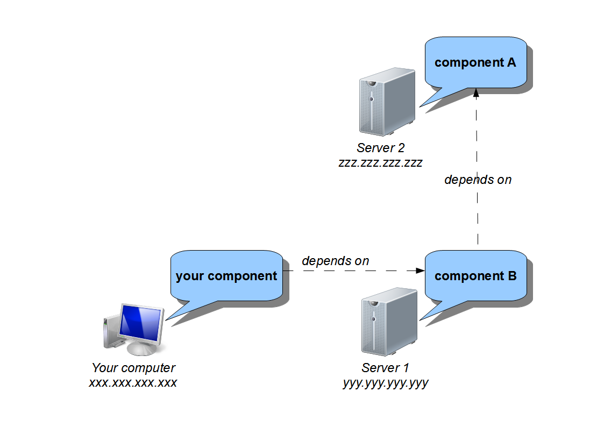
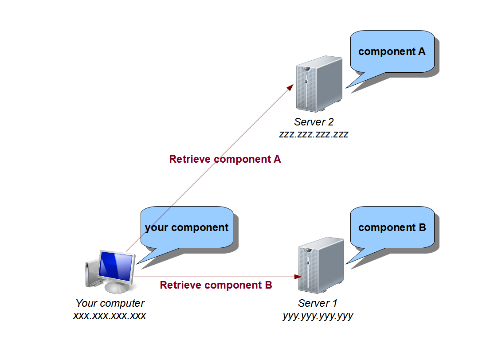

.. _advanced-understand:

Understand SBS
==============

This part announces the beginning of the advanced SBS tutorials.

In this chapter, you will see most of the important concepts and architectures used by SBS.

Repository and component handling
---------------------------------

To explain how several server and component are handled, we will take a simple example :

* you, with your computer and your SBS component/project, :)
* a first server, with a first component needed by yours,
* a second server, with a second component needed by the first one.

The general idea behind component handling is to let the client (you) compute all the dependencies by itself, and allow the servers to do as less as jobs as possible.

Pros :

* No server overload due to too many connections to severals servers
* Servers only need to know the component data (server path, component name, version, ...), but never need to retrieve a component. Each server stays the owner of its components.
  
Cons :

* In case of dependency break (external server down, component removed, ...), the clients will not be able to automatically recover if it doesn't already get the component on this side.
* The client should need to recompute (and so resend messages to the servers) the dependencies.
  
In order to cope with the last con, SBS put in place an intermediate format to allow to not recompute the dependencies : the *crumble* files (see example into :ref:`Dependencies <tutorial-dependencies>` part).

The aim is to compute the dependency only once by putting them into *crumble* files and to publish those *crumble* in order to be used by other users.

For our example, we should have this kind of crumble file (for MingW32 toolchain) :
   
.. code-block:: xml

   <?xml version="1.0" encoding="UTF-8"?>
   <crumble>
      <server name="server1" path="yyy.yyy.yyy.yyy" port="58553">
         <repository name="tutorial" location-type="remote" delivery="release">
            <component name="Component/A" version="1.0.0" toolchain="x86-32_mingw" buildmode="release" />
            <component name="Component/A" version="1.0.0" toolchain="x86-32_mingw" buildmode="debug" />
         </repository>
      </server>
      <server name="server2" path="zzz.zzz.zzz.zzz" port="58553">
         <repository name="tutorial" location-type="remote" delivery="release">
            <component name="Component/B" version="1.0.0" toolchain="x86-32_mingw" buildmode="release" />
            <component name="Component/B" version="1.0.0" toolchain="x86-32_mingw" buildmode="debug" />
         </repository>
      </server>
   </crumble>

The end user user only need to use the :ref:`feed target <target-feed>` to declare all components from the *crumble* file.

Once the *crumble* file has been used, the client only need to build its component in order to automatically retrieve the components directly from the owner servers :
   

   
How to build crumble files
--------------------------

Unfortunately, there is no way to currently build a crumble file with the dependency tree from a project or a single dependency.
The needed message architecture isn't built in the currently SBS implementation.

However, all servers can provide the list of local components in crumble files.
