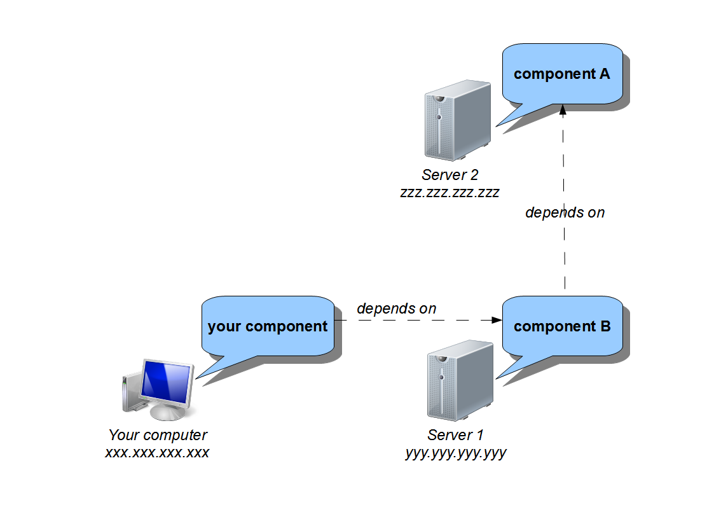
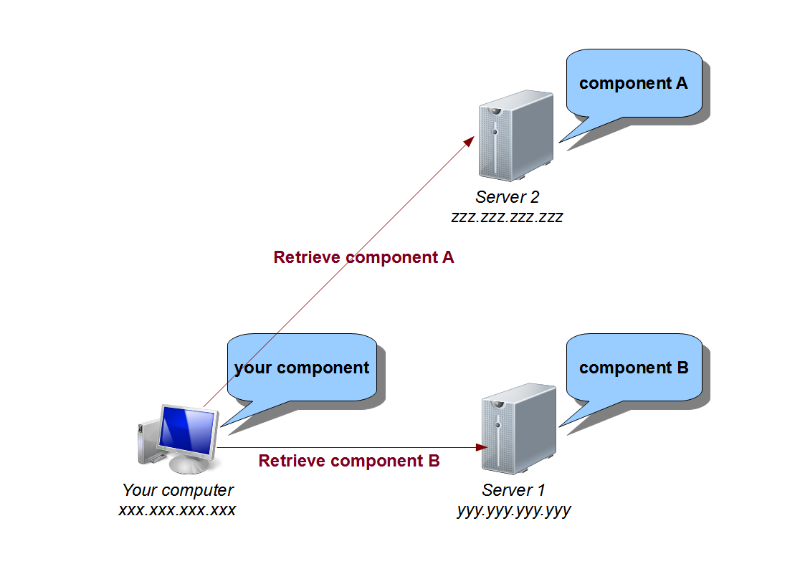

.. _advanced-understand:

Understand SBS
==============

This part announces the beginning of the advanced SBS tutorials.

In this chapter, you will see most of the important concepts and architectures used by SBS.

Repository and component handling
---------------------------------

To explain how several server and component are handled, we will take a simple example :

* you, with your computer and your SBS component/project, :)
* a first server, with a first component needed by yours,
* a second server, with a second component needed by the first one.

The general idea behind component handling is to let the client (you) compute all the dependencies by itself, and allow the servers to do as less as jobs as possible.

Pros :

* No server overload due to too many connections to severals servers
* Servers only need to know the component data (server path, component name, version, ...), but never need to retrieve a component. Each server stays the owner of its components.
  
Cons :

* In case of dependency break (external server down, component removed, ...), the clients will not be able to automatically recover if it doesn't already get the component on this side.
* The client should need to recompute (and so resend messages to the servers) the dependencies.
  
In order to cope with the last con, SBS put in place an intermediate format to allow to not recompute the dependencies : the *crumble* files (see example into :ref:`Dependencies <tutorial-dependencies>` part).

The aim is to compute the dependency only once by putting them into *crumble* files and to publish those *crumble* in order to be used by other users.

For our example, we should have this kind of crumble file (for MingW32 toolchain) :
   
.. code-block:: xml

   <?xml version="1.0" encoding="UTF-8"?>
   <crumble>
      <server name="server1" path="yyy.yyy.yyy.yyy" port="58553">
         <repository name="tutorial" location-type="remote" delivery="release">
            <component name="Component/A" version="1.0.0" toolchain="x86-32_mingw" buildmode="release" />
            <component name="Component/A" version="1.0.0" toolchain="x86-32_mingw" buildmode="debug" />
         </repository>
      </server>
      <server name="server2" path="zzz.zzz.zzz.zzz" port="58553">
         <repository name="tutorial" location-type="remote" delivery="release">
            <component name="Component/B" version="1.0.0" toolchain="x86-32_mingw" buildmode="release" />
            <component name="Component/B" version="1.0.0" toolchain="x86-32_mingw" buildmode="debug" />
         </repository>
      </server>
   </crumble>

The end user user only need to use the :ref:`feed target <target-feed>` to declare all components from the *crumble* file.

Once the *crumble* file has been used, the client only need to build its component in order to automatically retrieve the components directly from the owner servers :
   

   
How to build crumble files
--------------------------

Unfortunately, there is no way to currently build a crumble file with the dependency tree from a project or a single dependency.
The needed message architecture isn't built in the currently SBS implementation.

However, all servers can provide the list of local components in crumble files.

SBS_HOME
--------

All the SBS configuration is handle under one folder, the *SBS_HOME*.
It contains configuration, repositories, remote components, ... files.

By default, no environment variable is set for *SBS_HOME*.

*SBS_HOME* default values :

* Under Linux : `$HOME/.sbs/` (example : `/home/user/.sbs/`)
* Under Windows Vista/7 : `%USERPROFILE%/.sbs/` (example : `C:/Users/User/.sbs/`)
* Under Windows XP : `%USERPROFILE%/.sbs/` (example : `C:/Documents and Settings/User/.sbs/`)

If the variable is set, it overwrites the default *SBS_HOME* value.

By changing the *SBS_HOME* value, you can define completely seperated SBS environments.

Understand configuration files
------------------------------

Overview
~~~~~~~~

To understand how SBS file syntax, let's take an example from the SBS default configuration for MingW32 toolchain :

.. code-block:: sh

   #Mingw specific configuration file for SBS
   
   MINGW_ROOT = C:/Qt/qtcreator-2.2.1/mingw/bin
   
   #cmake and sbs platform configurations
   ENV_NAME = MingW
   TARGET_ENV = MinGW Makefiles
   MAKE_PROGRAM = ${MINGW_ROOT}/mingw32-make.exe
   C_COMPILER = ${MINGW_ROOT}/gcc.exe
   CPP_COMPILER = ${MINGW_ROOT}/g++.exe
   RC_COMPILER = ${MINGW_ROOT}/windres.exe
   
   CMAKE_ADD_VAR_SET = { \
      "CMAKE_EXE_LINKER_FLAGS":"-enable-auto-import"}
   
   #default paths
   DEFAULT_SHARED_LIB_COMPILE_NAME = ${LIB_NAME}
   DEFAULT_SHARED_LIB_FULL_NAME = lib${LIB_NAME}.dll
   DEFAULT_STATIC_LIB_COMPILE_NAME = ${LIB_NAME}
   DEFAULT_STATIC_LIB_FULL_NAME = lib${LIB_NAME}.a
   DEFAULT_EXE_FULL_NAME = ${EXE_NAME}.exe
   
   #build command
   COMPILE_COMMAND = ${MINGW_ROOT}/mingw32-make all
   
   #launch executable (run and test command)
   LAUNCH_COMMAND = ${EXE_NAME}.exe

The configuration files are only capable to set variables from strings and/or other variables.
The values aren't directly computed, but are stored into a global context, and are only evaluated at *retrieve time* by SBS.

Pros :

* Files are only read once.
* Variable values independent from the file reading order.
* One variable for several possible values depending on the context.
* Lazy evaluation.

Cons :

* Impossible to overwrite variables.
* Possible several evaluations for the same variable and the same final value.

Basic evaluation
~~~~~~~~~~~~~~~~

Let's take a simple example of evaluation.

Input :

.. code-block:: sh

   #Mingw specific configuration file for SBS
   
   MINGW_ROOT = C:/Qt/qtcreator-2.2.1/mingw/bin
   
   #cmake and sbs platform configurations
   MAKE_PROGRAM = ${MINGW_ROOT}/mingw32-make.exe

SBS evaluation :

.. code-block:: sh

   MINGW_ROOT = C:/Qt/qtcreator-2.2.1/mingw/bin
   MAKE_PROGRAM = C:/Qt/qtcreator-2.2.1/mingw/bin/mingw32-make.exe

The *MINGW_ROOT* variable could be set in another configuration file as well, without any change on the output values.

Contextual evaluation
~~~~~~~~~~~~~~~~~~~~~

As you can see in the example, some of the variable aren't fully evaluable from the configuration files :

.. code-block:: sh

   DEFAULT_SHARED_LIB_COMPILE_NAME = ${LIB_NAME}
   DEFAULT_SHARED_LIB_FULL_NAME = lib${LIB_NAME}.dll
   DEFAULT_STATIC_LIB_COMPILE_NAME = ${LIB_NAME}
   DEFAULT_STATIC_LIB_FULL_NAME = lib${LIB_NAME}.a
   DEFAULT_EXE_FULL_NAME = ${EXE_NAME}.exe

In this example, *LIB_NAME* and *EXE_NAME* aren't set by the configuration file, but by SBS itself. 
For example, if you build a library named *MyLib*, you will get the following evaluation :

.. code-block:: sh

   DEFAULT_SHARED_LIB_COMPILE_NAME = MyLib
   DEFAULT_SHARED_LIB_FULL_NAME = libMyLib.dll
   DEFAULT_STATIC_LIB_COMPILE_NAME = MyLib
   DEFAULT_STATIC_LIB_FULL_NAME = libMyLib.a
   DEFAULT_EXE_FULL_NAME = <undefined>

